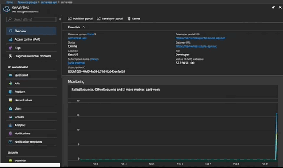
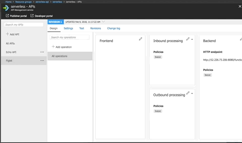
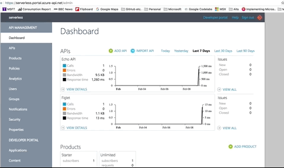

# Serverless On AKS

**NOTE: This is still WIP as I need to add OAuth and metrics overview**


AKS (Azure Container Service for Kubernetes) is Microsoft's fully managed, and hosted Kubernetes container orchestrator.  We take care of the availability, scalability and resilience of the Master nodes within the cluster and you will only be charged for the Agent nodes.

This greatly simplifies your life as a Kubernetes administrator and allows you to concentrate on more of the fun stuff (like Serverless!)

This walkthrough is how to go from zero to hero with AKS and Serverless frameworks.


## OpenFaaS
[Alex](https://twitter.com/alexellisuk?lang=en) has done a fantastic job with [OpenFaaS](https://www.openfaas.com/), and has built a great community around the framework.  Let's start with that and we can delve into some of the other popular frameworks later.

## Get AKS up and running
As with every runthrough, let's start at the beginning and create a resource group to hold the cluster.

```
➜  ServerlessOnAKS (master) ✗ az group create -n serverless -l eastus
Location    Name
----------  ----------
eastus      serverless
```

And now to create your AKS cluster

```
➜  az aks create -n openfaas -g serverless -c 5
DnsPrefix                   Fqdn                                                      KubernetesVersion    Location    Name      ProvisioningState    ResourceGroup
--------------------------  --------------------------------------------------------  -------------------  ----------  --------  -------------------  ---------------
openfaas-serverless-63bb10  openfaas-serverless-63bb10-e5053bd3.hcp.eastus.azmk8s.io  1.7.7                eastus      openfaas  Succeeded            serverless
```
Note: In this case, I've passed the node count parameter (-c) to specify I want 5 agent nodes created.  The default is 3.

### Get AKS crendentials
Once the AKS cluster is available, you will need to merge the configuration within the *kubectl* context.

```
➜  az aks get-credentials -n openfaas -g serverless
Merged "openfaas" as current context in /Users/juda/.kube/config
```

## Backing Services
For this walkthrough I've written a small Python app to save telemetry from user interacting on a website into CosmosDB.  I won't go into Cosmos in too much detail, but it is Microsoft's globally distributed and highly scalable/available multi-model database.  I love it it as it has a native Mongo interface to store my data.  This means I can use Pymongo for Python, or Mongoid when I feel like cranking some Ruby.

### Deploy Cosmos DB
I'd recommend creating a new resource group for backing services outside of the AKS cluster group.

```
➜  az group create -n openfaas-backing -l eastus
Location    Name
----------  ----------------
eastus      openfaas-backing
```

And deploy a CosmosDB instance of type "Mongo".

```
➜  ~ az cosmosdb create -n openfaas-cosmos -g openfaas-backing --kind MongoDB


DatabaseAccountOfferType    DocumentEndpoint                                  Kind     Location    Name             ProvisioningState    ResourceGroup
--------------------------  ------------------------------------------------  -------  ----------  ---------------  -------------------  ----------------
Standard                    https://openfaas-cosmos.documents.azure.com:443/  MongoDB  East US     openfaas-cosmos  Succeeded            openfaas-backing
```

# Install OpenFaaS

```
➜  GitHub git clone https://github.com/openfaas/faas-netes
Cloning into 'faas-netes'...
remote: Counting objects: 2065, done.
remote: Compressing objects: 100% (14/14), done.
remote: Total 2065 (delta 9), reused 9 (delta 4), pack-reused 2047
Receiving objects: 100% (2065/2065), 2.16 MiB | 2.04 MiB/s, done.
Resolving deltas: 100% (910/910), done.
➜  GitHub cd faas-netes 
```

## Create OpenFaaS namespaces

```
➜  faas-netes git:(master) kubectl apply -f namespaces.yml 
namespace "openfaas" created
namespace "openfaas-fn" created
```

## Install OpenFaaS

```
➜  faas-netes git:(master) kubectl apply -f yaml
service "alertmanager" created
deployment "alertmanager" created
configmap "alertmanager-config" created
service "faas-netesd" created
deployment "faas-netesd" created
deployment "gateway" created
service "gateway" created
service "nats" created
deployment "nats" created
service "prometheus" created
deployment "prometheus" created
configmap "prometheus-config" created
deployment "queue-worker" created
serviceaccount "faas-controller" created
role "faas-controller" created
rolebinding "faas-controller-fn" created
```

## Remove NodePort configuration for gateway

By default, the OpenFaas gateway uses a NodePort service definition.  Delete the gateway service

```
➜  faas-netes git:(master) kubectl delete service gateway --namespace openfaas
```

And edit the file *cloud/lb.yml*.  Add the namespace defintion for the Service (line 5).

```
apiVersion: v1
kind: Service
metadata:
  name: gateway
  namespace: openfaas
  labels:
    app: gateway
spec:
  ports:
    - port: 8080
      protocol: TCP
      targetPort: 8080
      nodePort: 31112
  selector:
    app: gateway
  type: LoadBalancer #LB
```


## Deploy LoadBalancer service 

```
➜  faas-netes git:(master) kubectl apply -f cloud/lb.yml
service "gateway" created
```

### Get Gateway Endpoint
Once the service has been deployed, you should be able to see the Gateway public IP address.

```
kubectl get svc -n openfaas
NAME           TYPE           CLUSTER-IP     EXTERNAL-IP     PORT(S)          AGE
alertmanager   ClusterIP      10.0.121.41    <none>          9093/TCP         27m
faas-netesd    ClusterIP      10.0.207.218   <none>          8080/TCP         27m
gateway        LoadBalancer   10.0.199.149   52.226.73.206   8080:31112/TCP   8m
nats           ClusterIP      10.0.243.133   <none>          4222/TCP         27m
prometheus     NodePort       10.0.129.47    <none>          9090:31119/TCP   27m
```

## Test OpenFaas
Goto the endpoint IP address with your browser, port 8080.  And create your first OpenFaas function - we'll use the Figlet service from the marketplace.


And let's use curl for this endpoint

```
➜  ServerlessOnAKS git:(master) ✗ curl -X POST http://52.226.73.206:8080/function/figlet -d "Hello Azure"
 _   _      _ _            _                        
| | | | ___| | | ___      / \    _____   _ _ __ ___ 
| |_| |/ _ \ | |/ _ \    / _ \  |_  / | | | '__/ _ \
|  _  |  __/ | | (_) |  / ___ \  / /| |_| | | |  __/
|_| |_|\___|_|_|\___/  /_/   \_\/___|\__,_|_|  \___|

```

# Deploy Azure API Management Service

Azure API Management (APIM) is a service within Azure to front your API calls, and provide authentication, authorisation and metrics about APIs your create and publish.  With any type of Serverless technology or API exposure there are certain things that just need to be in place.  Microsoft offers a way for you to worry about code, and we can help take care of the operational overhead usually associated with exposed endpoints.

Now that OpenFaaS is installed, and is publishing one of the marketplace endpoints, let's go ahead an protect and monitor it.

## Deploy APIM
Login to the [portal](http://portal.azure.com) and search for APIM.


It's :coffee: time.  Deploying APIM takes about 30 minutes as there are a number of Azure services used to create a secure front-end for use across any resources you may need to protect.

## Create API for Figlet
Login to the portal, and click on the API section of the API Management pane.

You can go ahead and create the API endpoint.



### Create Figlet action
So now that the endpoint has been created, it's time to create the HTTP action (verb) for that action.



## Take a look at the developer portal
One of the really nice things about APIM is the fact that once you've defined your APIs, endpoints and actions, they are available for the general public to start using.

We create an administrative portal that contains call metrics, api breakdowns etc., but also a developer portal for users to sign up, view automatically generated documentation, as well as pre-canned code examples of how to interact with your new OpenFaas function.



